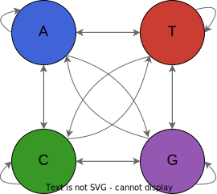

<p align="center">
  <br/>
  <i>DNA as Markov chains</i><br/><br/>
  <a href="https://camilogarciabotero.github.io/BioMarkovChains.jl/dev/">
    
  </a>
  <a href="https://github.com/camilogarciabotero/BioMarkovChains.jl/releases/latest"> 
  
    <!-- <a href="https://doi.org/10.5281/zenodo.7519184"></a>
  </a> -->
  <a href="https://app.travis-ci.com/camilogarciabotero/BioMarkovChains.jl">
    
   <a href="https://github.com/camilogarciabotero/BioMarkovChains.jl/actions/workflows/CI.yml">
    
  <a href="https://github.com/camilogarciabotero/BioMarkovChains.jl/blob/main/LICENSE">
    
  </a>
  <a href="https://www.repostatus.org/#wip">
    
  </a>
</p>

***

# BioMarkovChains

> A Julia package to represent DNA as Markov chains

## Installation

<p>
BioMarkovChains is a &nbsp;
    <a href="https://julialang.org">
        
        Julia Language
    </a>
    &nbsp; package. To install BioMarkovChains,
    please <a href="https://docs.julialang.org/en/v1/manual/getting-started/">open
    Julia's interactive session (known as REPL)</a> and press <kbd>]</kbd>
    key in the REPL to use the package mode, then type the following command
</p>

```julia
pkg> add BioMarkovChains
```

## Creating transition models out of DNA sequences

An important step bedford developing several of the gene finding algorithms, consist of having a Markov chain representation of the DNA. To do so, we implement a the `transition_model` method that will capture the initials and transition probabilities of a DNA sequence (`LongSequence`) and will create a dedicated object storing relevant information of a DNA Markov chain. Here an example:

Let find one ORF in a random `LongDNA` :

```julia
using BioSequences, GeneFinder

sequence = randdnaseq(10^3)
orfdna = getorfdna(sequence, min_len=75)[1]
```

If we translate it, we get a 69aa sequence:

```julia
translate(orfdna)
```

```
69aa Amino Acid Sequence:
MSCGETTVSPILSRRTAFIRTLLGYRFRSNLPTKAERSRFGFSLPQFISTPNDRQNGNGGCGCGLENR*
```

Now supposing I do want to see how transitions are occurring in this ORF sequence, the I can use the `transition_model` method and tune it to 2nd-order Markov chain:

```julia
transition_model(orfdna, 2)
```

```
TransitionModel:
  - Transition Probability Matrix (Size: 4 × 4):
    0.278	0.272	0.228	0.222
    0.276	0.273	0.231	0.22
    0.286	0.269	0.242	0.204
    0.266	0.275	0.236	0.224
  - Initials (Size: 1 × 4):
    0.277	0.272	0.233	0.218
  - order: 2
```

This is  useful to later create HMMs and calculate sequence probability based on a given model, for instance we now have the *E. coli* CDS and No-CDS transition models implemented:

```julia
ECOLICDS
```

```
TransitionModel:
  - Transition Probability Matrix (Size: 4 × 4):
    0.31	0.224	0.199	0.268
    0.251	0.215	0.313	0.221
    0.236	0.308	0.249	0.207
    0.178	0.217	0.338	0.267
  - Initials (Size: 1 × 4):
    0.245	0.243	0.273	0.239
  - order: 1
```

What is then the probability of the previous random Lambda phage DNA sequence given this model?

```julia
sequenceprobability(orfdna, ECOLICDS)
```

```
1.9478492511798446e-125
```

This is of course not very informative, but we can later use different criteria to then classify new ORFs. For a more detailed explanation see the [docs](https://camilogarciabotero.github.io/BioMarkovChains.jl/dev/biomarkovchains/)

## License

MIT License
